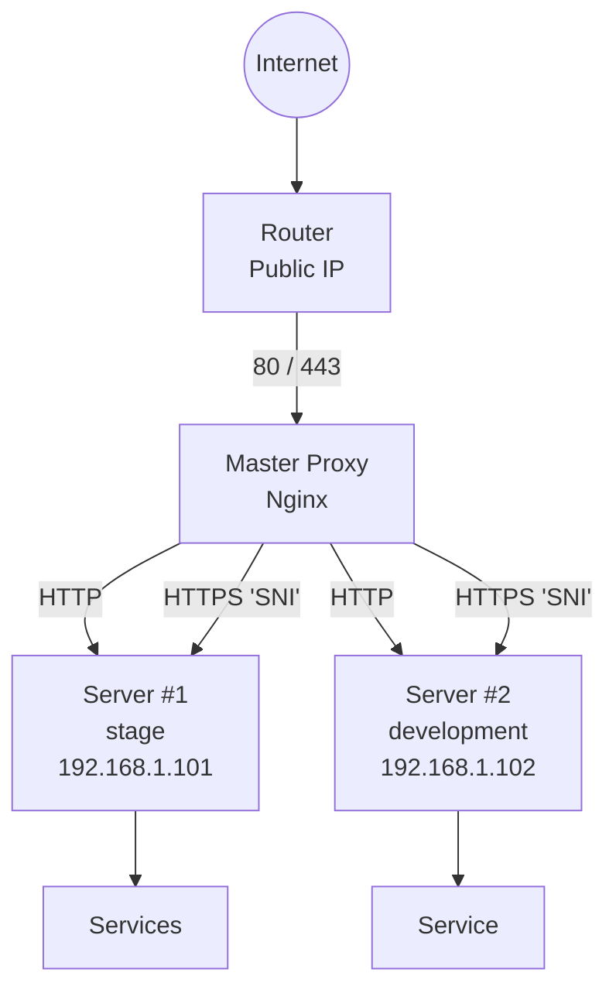

# Master Proxy (Nginx Stream + HTTP)

## Table of contents
* *[Purpose](#Purpose)*
* *[Architecture and traffic flow](#architecture-and-traffic-flow)*
* *[Router requirements (NAT)](#router-requirements-nat)*
* *[HTTP proxying (port 80)](#http-proxying-port-80)*
* *[HTTPS proxying (port 443, stream)](#https-proxying-port-443-stream)*
* *[Stream traffic logging](#stream-traffic-logging)*
* *[Routing by domain and client IP](#routing-by-domain-and-client-ip)*
* *[Reject-server](#Reject-server)*
* *[Management and deploymentе](#management-and-deployment)*

---
## Purpose
Master Proxy is used when you need to run multiple servers or services
but can’t assign a separate public IP to each one.

Instead:
  - one public server runs Nginx (the master proxy)
  - all incoming traffic goes to it
  - requests are routed into the internal network by domain name

This way, different services on different servers are available under their own domains,
even though there is only one public IP.

---

## Architecture and traffic flow

### General flow
1. Incoming HTTP/HTTPS traffic hits the master proxy
2. Nginx inspects:
   - the domain name (`Host` / `SNI`)
   - optionally, the client IP
3. Based on the domain, the request is forwarded to the target server.
That server’s Nginx handles the request and routes it to the right service.
> SSL certificates are stored on the target servers, not on the proxy.

### Traffic flow diagram


---

## Router requirements (NAT)


For Master Proxy to work correctly, port forwarding must be configured on the external router:
- 80 → master proxy:80
- 443 → master proxy:443

The router should do only L3/L4 NAT and must not:
- terminate SSL
- perform HTTP/HTTPS filtering
- modify headers

All routing logic lives entirely on the Nginx master proxy.

---

## HTTP proxying (port 80)

HTTP traffic uses the standard Nginx`http` module.

### How it works

On the *master proxy*, a `map`, is used to match a domain to a backend:

```commandline
map $host $backend_http {
    staging.example.com        http://192.168.1.101:80;
    dev.example.com            http://192.168.1.104:80;
    default                    http://192.168.4.101:80;
}
```

All HTTP requests then go through a single server block:
```commandline
server {
    listen 80;
    server_name _;

    location / {
        proxy_pass $backend_http;
        proxy_set_header Host $host;
    }
}
```

Result:
- the domain decides the backend
- the proxy stays a simple router
---

## HTTPS proxying (port 443, stream)

HTTPS uses the Nginx stream module, not `http`.

Why stream?
 - TLS is not decrypted on the proxy
 - SSL certificates live on backend servers
 - the proxy works at the TCP level

This allows:
 - no private keys on the proxy
 - any TLS setup on backend servers

---

## Stream traffic logging
The logging format is defined in `base-stream.conf`:

```commandline
log_format stream_log '$remote_addr [$time_local] '
                      'sni="$ssl_preread_server_name" target="$target"';

access_log /var/log/nginx/stream_access.log stream_log;
```
---

## Routing by domain and client IP

Routing is done with a `map` using this pair:
    SNI | client IP → backend


**Example:**
```commandline
map "$ssl_preread_server_name|$remote_addr" $target {

    "staging.example.com|88.88.88.88"   192.168.1.101:443;
    "dev.example.com |88.88.88.88"      192.168.1.104:443;

    # no IP restriction
    ~^dev-1\.example\.com|              192.168.1.104:443;

    default                             127.0.0.1:9443;
}
```

### Entry format:
    domain|allowed_IP → internal_IP:port

If no IP restriction is needed, a regex is used without specifying the IP.

### Main stream server

```commandline
server {
    listen 443;
    ssl_preread on;
    proxy_pass $target;
}

```

If the domain or IP does not match any rule, the connection is sent to the reject server.

---

## Reject-server

```commandline
server {
    listen 9443;
    return 0;
}
```

Used to:
- immediately close the TCP connection
- block unauthorized domains and IPs

---

## Management and deployment
Master proxy configuration is managed via Ansible.

Apply the configuration with:

```bash
make master-proxy-setup
```

During the process:

- Nginx is installed
- configuration files are deployed
- stream and http configs are applied
- Nginx is tested and reloaded
