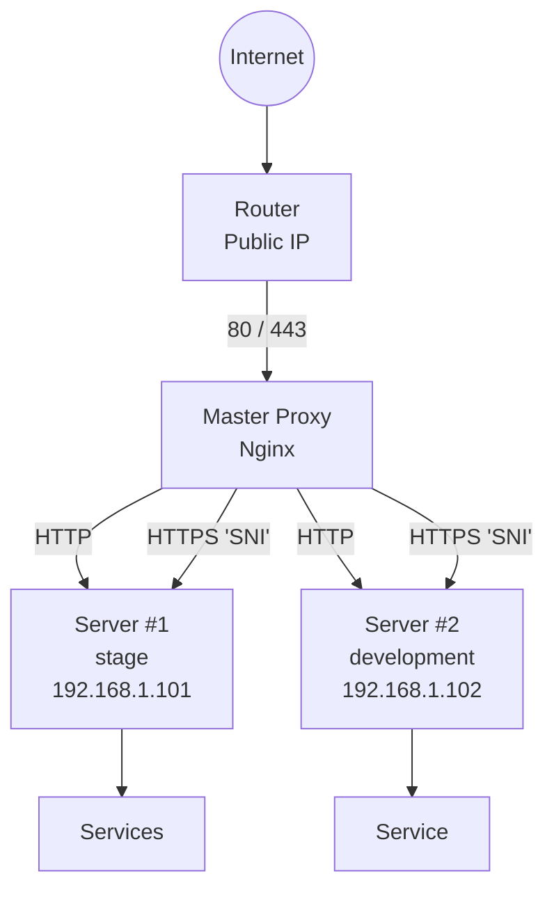

# Master Proxy (Nginx Stream + HTTP)

## Оглавление
* *[Назначение](#назначение)*
* *[Архитектура и схема работы](#архитектура-и-схема-работы)*
* *[Требования к маршрутизатору (NAT)](#требования-к-маршрутизатору-nat)*
* *[HTTP-проксирование (порт 80)](#http-проксирование-порт-80)*
* *[HTTPS-проксирование (порт 443, stream)](#https-проксирование-порт-443-stream)*
* *[Логирование stream-трафика](#логирование-stream-трафика)*
* *[Маршрутизация по домену и IP клиента](#маршрутизация-по-домену-и-ip-клиента)*
* *[Reject-сервер](#Reject-сервер)*
* *[Управление и развёртывание](#управление-и-развёртывание)*

---
## Назначение
Master Proxy используется в сценариях, когда необходимо развернуть несколько серверов или сервисов,
но нет возможности выделить отдельный публичный IP-адрес для каждого сервера.

Вместо этого:
  - используется один публичный сервер с Nginx (master proxy)

  - все входящие запросы принимаются на нём

  - запросы маршрутизируются во внутреннюю сеть по доменным именам

Таким образом, разные сервисы на разных серверах становятся доступными по своим доменам,
несмотря на наличие только одного публичного IP.

---

## Архитектура и схема работы

### Общая логика
1. Входящий HTTP/HTTPS-трафик приходит на master proxy
2. Nginx анализирует:
   - доменное имя (`Host` / `SNI`)
   - (опционально) IP адрес клиента
3. В зависимости от домена запроса далее перенаправляется на нужный сервер. 
На котором nginx сервера сам обработает запрос и перенаправит на нужны сервис.
> SSL-сертификаты хранятся на целевых серверах, а не на прокси.

### Схема взаимодействия


---

## Требования к маршрутизатору (NAT)


Для корректной работы Master Proxy на внешнем маршрутизаторе обязательно должен быть настроен проброс портов:
- 80 → master proxy:80
- 443 → master proxy:443

Маршрутизатор должен выполнять только L3/L4 NAT и не должен:
- терминировать SSL
- выполнять HTTP/HTTPS-фильтрацию
- изменять заголовки

Вся логика маршрутизации реализуется исключительно на Nginx master proxy.

---

## HTTP-проксирование (порт 80)

Для HTTP-запросов используется стандартный `http` модуль Nginx

### Принцип работы

На *master proxy* настраивается `map`, который сопоставляет домен с сервисом:

```commandline
map $host $backend_http {
    staging.example.com        http://192.168.1.101:80;
    dev.example.com            http://192.168.1.104:80;
    default                    http://192.168.4.101:80;
}
```

Далее все HTTP-запросы проксируются через единый server-блок:
```commandline
server {
    listen 80;
    server_name _;

    location / {
        proxy_pass $backend_http;
        proxy_set_header Host $host;
    }
}
```

Таким образом:
- домен определяет backend
- прокси остаётся полностью “тупым” маршрутизатором
---

## HTTPS-проксирование (порт 443, stream)

Для HTTPS используется `stream-модуль` Nginx, а не `http`.

Почему stream?

 - TLS-сессия не расшифровывается на прокси
 - SSL-сертификаты хранятся на целевых серверах
 - Прокси работает на уровне TCP

Это позволяет:

 - не хранить приватные ключи на proxy
 - использовать любые TLS-настройки на backend-серверах
---

## Логирование stream-трафика
В файле `base-stream.conf` задаётся формат логирования:

```commandline
log_format stream_log '$remote_addr [$time_local] '
                      'sni="$ssl_preread_server_name" target="$target"';

access_log /var/log/nginx/stream_access.log stream_log;
```
---

## Маршрутизация по домену и IP клиента

Используется `map` по связке:


    SNI | IP клиента → backend


**Пример:**
```commandline
map "$ssl_preread_server_name|$remote_addr" $target {

    "staging.example.com|88.88.88.88"   192.168.1.101:443;
    "dev.example.com |88.88.88.88"      192.168.1.104:443;

    # без ограничения по IP
    ~^dev-1\.example\.com|              192.168.1.104:443;

    default                             127.0.0.1:9443;
}
```

### Формат записи:
    домен|разрешённый_IP → внутренний_IP:порт

Если ограничение по IP не требуется, используется регулярное выражение без указания IP.

### Основной stream server

```commandline
server {
    listen 443;
    ssl_preread on;
    proxy_pass $target;
}

```

Если домен/IP не совпали ни с одним правилом, то соединение отправляется на reject-сервер (отбойник).

---

## Reject-сервер

```commandline
server {
    listen 9443;
    return 0;
}
```

Используется для:
- мгновенного закрытия TCP-соединения
- защиты от неразрешённых доменов и IP
---

## Управление и развёртывание
Настройка master proxy выполняется через Ansible.

Для применения конфигурации используется команда:

```commandline
make master-proxy-setup
```
В процессе:

- устанавливается Nginx
- разворачиваются конфигурационные файлы
- применяется stream + http конфигурация
- выполняется проверка и перезагрузка Nginx
